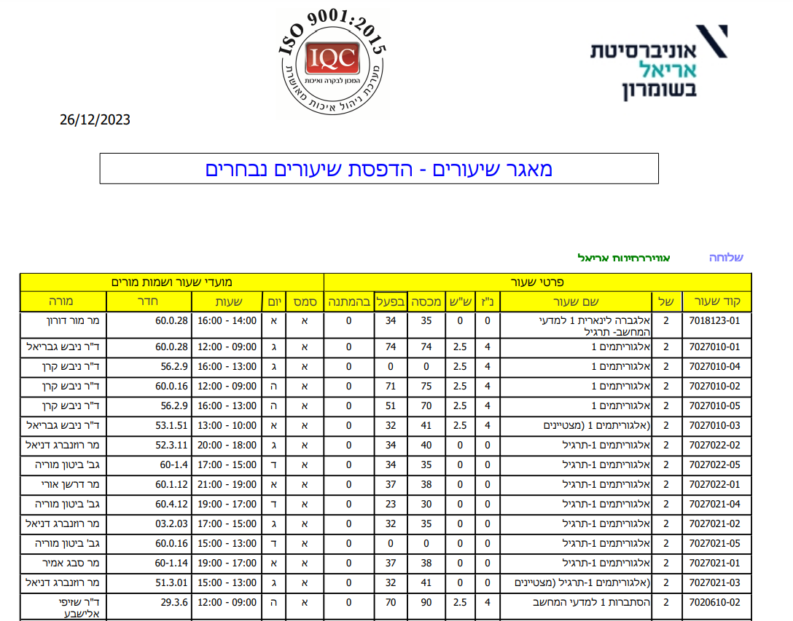
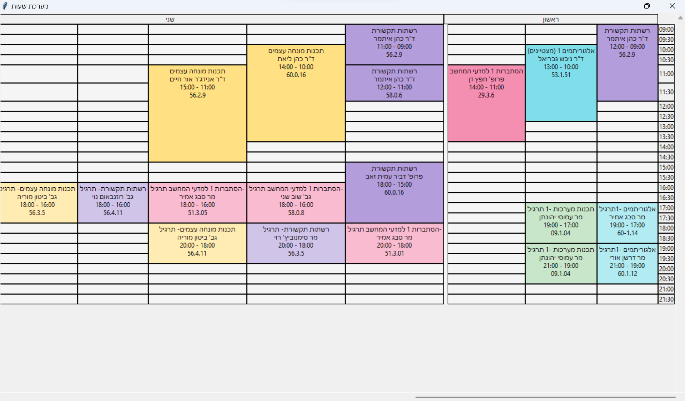

# Create Schedule

This is a small project that creates a schedule for my university courses.

my university gives me the lectures schedule in a pdf file, table format, so I convert it to a csv file and then I `tkinter` to create a schedule.

| original                         | output                             |
|----------------------------------|------------------------------------|
|  |  |


## How to use it

if you want to run it:
make sure that you have python 3.6 or higher installed on your computer.
make sure that you have java installed on your computer, and the system variable `JAVA_HOME` is set to the java
installation folder.

install the required packages by running:
```bash
pip install tabula-py
pip install pandas
```

now download the pdf file that contains the lectures, and put it in the data folder.

now change the name of the file to `src.pdf`, and run the following command:
```bash
python extract_tables.py
```

by default, the script will convert a file called `src.pdf`, if you want to convert a different file, you can pass the file name as an argument:
```bash
python extract_tables.py my_file.pdf
```

now you need to clean the data, open the csv file (you can do it with excel), and remove the unnecessary columns.

after this, you can run the following command:
```bash
python main.py
```

and you will see the schedule.

### change the colors

you can change the colors of the schedule by changing the values in the `utils.py` file.
